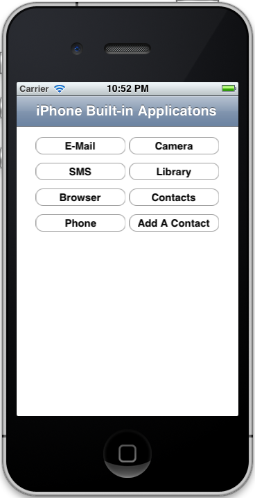

RubyMotion_APISampler
=====================

This small project (encapsualted in a single view class file) demonstrates many of the typical features in iOS with direct API calls to expose the 'magic'.

You can see examples of
 * Email
 * SMS Messages
 * Browser
 * Photo Library
 * Camera (this cannot be tested in the Simulator)
 * Phone
 * AddressBook
 * Add a Contact in the AddressBook

I hope this will serve as a tutorial and reference for you to add these capabilities in __YOUR__ projects.

This is a community project.  Please fork it and send pull requests so we can make it a useful example for the entire RubyMotion community.

{This uses iOS 5.0}
